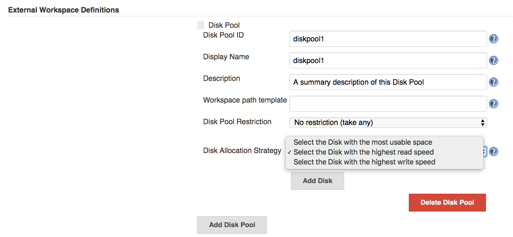
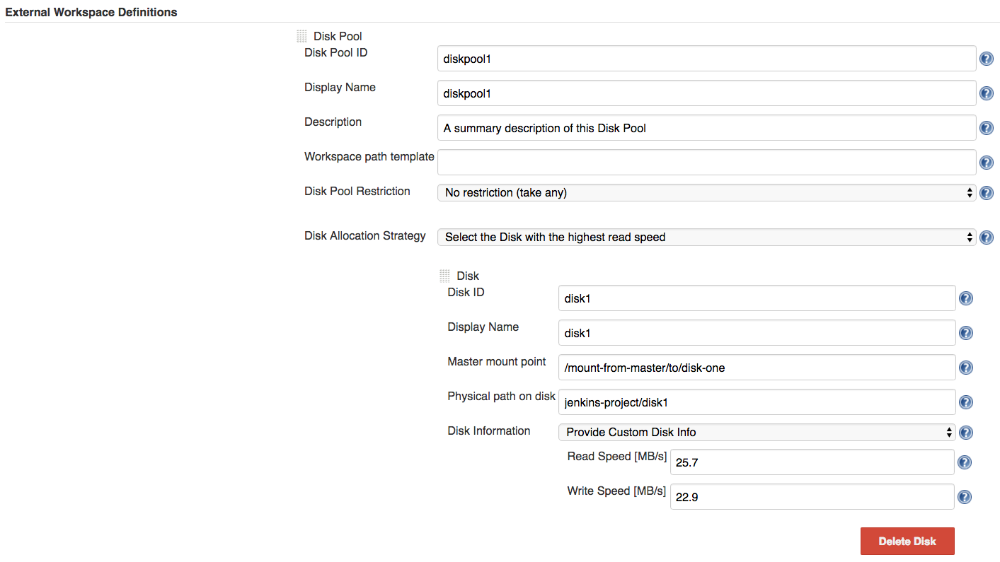

# Disk allocation strategies

The plugin provides flexible disk selection strategies. 
Currently, the user may choose to allocate a Disk from the Disk Pool using one of the following strategies:

1. [Select the Disk with the most usable space](select-the-disk-with-the-most-usable-space)
1. [Select the Disk with the highest read speed](select-the-disk-with-the-highest-read-speed)
1. [Select the Disk with the highest write speed](select-the-disk-with-the-highest-write-speed)

The default allocation strategy can provided in the Jenkins global config, for each Disk Pool entry, 
as shown in the image bellow:



The disk allocation strategy can then be overridden in the Pipeline code, as we will see in the afferent sections.

## Select the Disk with the most usable space

This strategy allocates the Disk that has the most usable space within the Disk Pool.
The Pipeline code can override the global config as following:

```groovy
def extWorkspace = exwsAllocate diskPoolId: 'diskpool1', strategy: mostUsableSpace() 
// ...
```

The strategy also accepts an optional parameter: `estimatedWorkspaceSize`.
This parameter ensures that the allocated Disk has the usable space greater that the estimated workspace size 
(disk's usable space > estimated workspace size):

```groovy
def extWorkspace = exwsAllocate diskPoolId: 'diskpool1', 
 strategy: mostUsableSpace(estimatedWorkspaceSize: 100) 
// ...
```

In our case, we have provided an estimated workspace size of _100 MB_. The value has to be in MB.
Let's assume that the allocation strategy has selected the disk with the most usable space, that has a value of 
_80 MB_. 
The disk's usable space is smaller than the estimated workspace size. 
The job will fail, because it could not find any disk that has the usable space > estimated workspace size.

## Select the Disk with the highest read speed

This strategy uses the disks' read speed to allocate the proper disk.
Currently, the only way to know this information is if we provide it in the Jenkins global config.
In the _External Workspace Definitions_ section, for each Disk, there is the _Disk Information_ entry:



After we have set the custom Disk Information, we can proceed forward to specify the allocation strategy that is based 
either on the disk's read speed, or on the disk's write speed.
The allocation strategies can be set in the Jenkins global config (as we have seen before), or it can be overridden in
the Pipeline code:

```groovy
def extWorkspace = exwsAllocate diskPoolId: 'diskpool1', strategy: fastestReadSpeed() 
```

Similar as in the previous example, we can specify the `estimatedWorkspaceSize` parameter:

```groovy
def extWorkspace = exwsAllocate diskPoolId: 'diskpool1', 
 strategy: fastestReadSpeed(estimatedWorkspaceSize: 100) 
```

If this parameter is provided, the strategy will alocate the disk with the fastest read speed, but that has its usable space at least equal to the estimated workspace size.

For example, let's assume that we have _disk1_ with read speed of _25 MB/s_ and usable space of _120 MB_, and _disk2_ with its reading speed of _30 MB/s_ but with a smaller usable space, _80_ MB.
If the `estimatedWorkspaceSize` parameter is given, with a value of _100 MB_, the allocation strategy will select _disk1_, because it has the minimum required usable space, even though its read speed is smaller than _disk2_.
If we do not pass the `estimatedWorkspaceSize` param, the strategy will ignore the disks' usable space and will allocate _disk2_, because it has the highest read speed.

## Select the Disk with the highest write speed

This strategy is very similar with the previous one, the main difference being that the disk is selected based on its write speed.
For this, the disks' write speed has to be provided in the _Disk Information_ section.

In the Pipeline code, it can be overridden as:

```groovy
def extWorkspace = exwsAllocate diskPoolId: 'diskpool1', strategy: fastestWriteSpeed() 
```

Or, with the `estimatedWorkspaceSize` parameter:

```groovy
def extWorkspace = exwsAllocate diskPoolId: 'diskpool1', 
 strategy: fastestWriteSpeed(estimatedWorkspaceSize: 100)
```

Same principles apply as the previous selection strategy.
