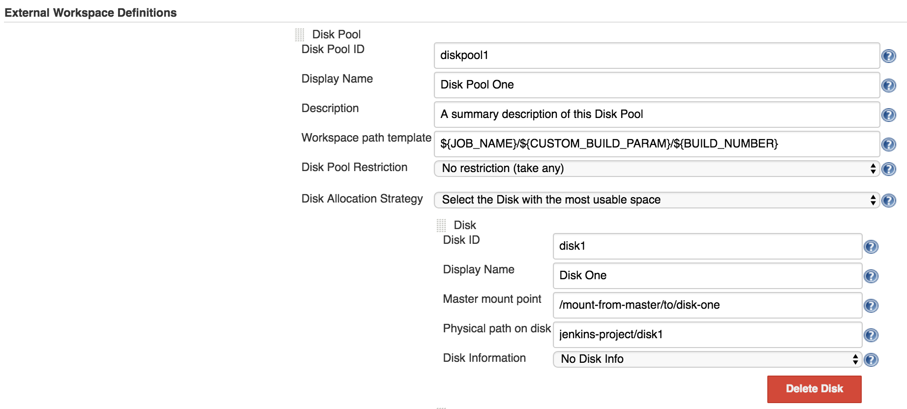

# Custom workspace path

By default, the workspace path on disk is computed based on the following pattern: 
_${physicalPathOnDisk}/${JOB_NAME}/${BUILD_NUMBER}_.
The _$physicalPathOnDisk_ is defined in the Jenkins global config, _External Workspace Definitions_ section, 
for each _Disk_ entry. 

If required, you can change the default workspace computation pattern. 
The plugin offers two alternatives for this:
 1. [Define a global workspace template for each Disk Pool](#define-a-global-workspace-template-for-each-disk-pool)
 1. [Define a custom workspace path in the Pipeline script](#define-a-custom-workspace-path-in-the-pipeline-script)

## Define a global workspace template for each Disk Pool

In the Jenkins global config, under the _External Workspace Definitions_ section, you can provide the 
_Workspace path template_ parameter. 

**Example**

Let's assume that we want the workspace path to be computed on disk based on the next template:
_${JOB_NAME}/${CUSTOM_BUILD_PARAM}/${BUILD_NUMBER}_.

Bellow is a Jenkins global config example:



And the Pipeline script:

```groovy
def extWorkspace
withEnv(['CUSTOM_BUILD_PARAM=100']) {
    stage ('Stage 1. Allocate workspace')
    extWorkspace = exwsAllocate diskPoolId: 'diskpool1'
}

node ('linux') {
    exws (extWorkspace) {
        stage ('Stage 2. Build')
        checkout scm
        sh 'mvn clean install -DskipTests'
    }
}

node ('test') {
    exws (extWorkspace) {
        stage ('Stage 3. Test')
        sh 'mvn test'
    }
}
```

**Stage 1. Allocate workspace**

For Disk Pool identified by _diskpool1_ we have provided the *Workspace path template* parameter. 
Therefore, the `exwsAllocate` step will try to resolve the parameters provided in the template:
 - It will replace the _${JOB_NAME}_ with the actual name of the project. 
Let's say the job is named _foobar_.
 - Then, it will resolve the _${CUSTOM_BUILD_PARAM}_ argument that we have provided at `withEnv([''])` step, 
replacing it with _100_.
 - Finally, the _${BUILD_NUMBER}_ will have the value of the current build number, e.g. _20_.

The resulting workspace path to be allocated on the disk is: _foobar/100/20_.

**Stage 2. Build** and **Stage 3. Test**

The `exws` step will compute the complete workspace path, appending the mounting point from the 
Jenkins node with the allocated path on disk.
The resulting path will be: _/mounting-point-from-node-to-disk/foobar/100/20_.

## Define a custom workspace path in the Pipeline script

