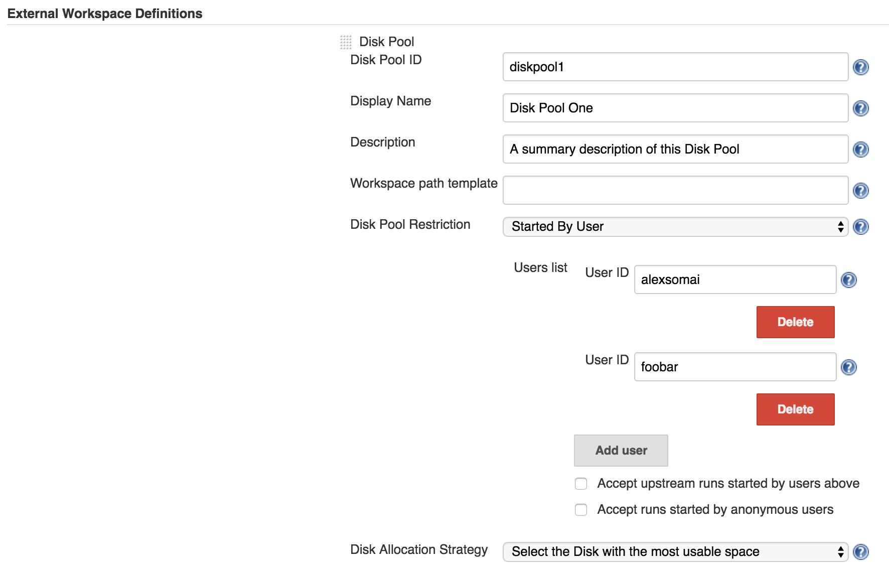
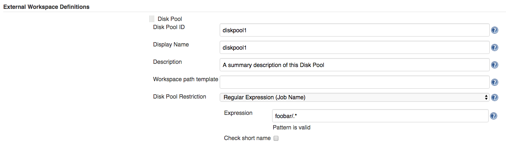
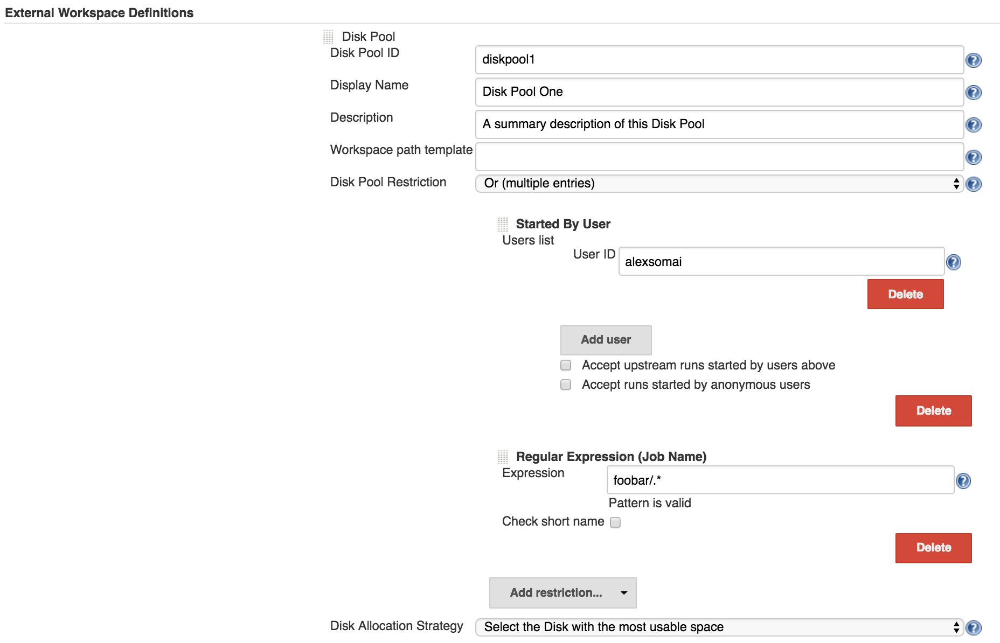

# Disk Pool restriction

The plugin allows Disk Pool restriction only for specific users (groups) or for specific jobs.
It does this by integrating the [Job Restrictions Plugin](https://github.com/jenkinsci/job-restrictions-plugin).

## Examples

### Disk Pool restriction by user

You can restrict the Disk Pool to be allocated only if the job was started by the user(s) mentioned in the list.
In the example below, the Disk Pool identified by _diskpool1_ will be allocated only if the job is triggered by 
one of the users _alexsomai_ or _foobar_.

Similarly, if you'd like to restrict the Disk Pool for specific groups, you must use the `Started by member of group` 
restriction.

### Disk Pool restriction by job name

You can restrict the Disk Pool to be allocated only in the jobs whose name matches a specific pattern, 
or if they are located in a certain directory.
In the following example, the _diskpool1_ will be allocated only for those jobs that are within the _Folder_ named
_foobar_.

### Combined Disk Pool restrictions

Even more, you can specify combined restrictions by using `And`, `Or` and `Not` operands.
For example, you can restrict the Disk Pool to be allocated only of the job was triggered by the user _alexsomai_ 
**or** if the job is located in the _foobar_ Folder.

