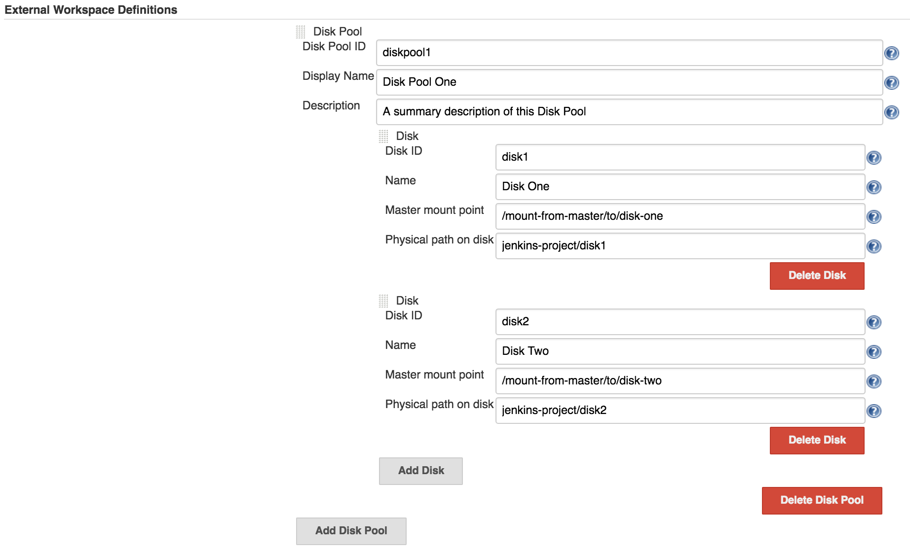
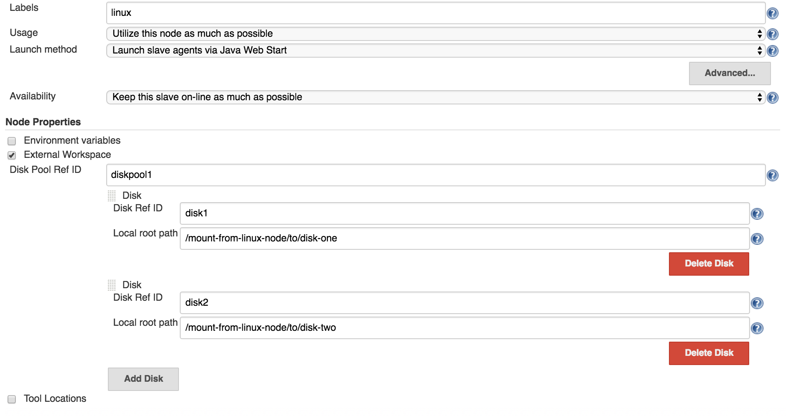
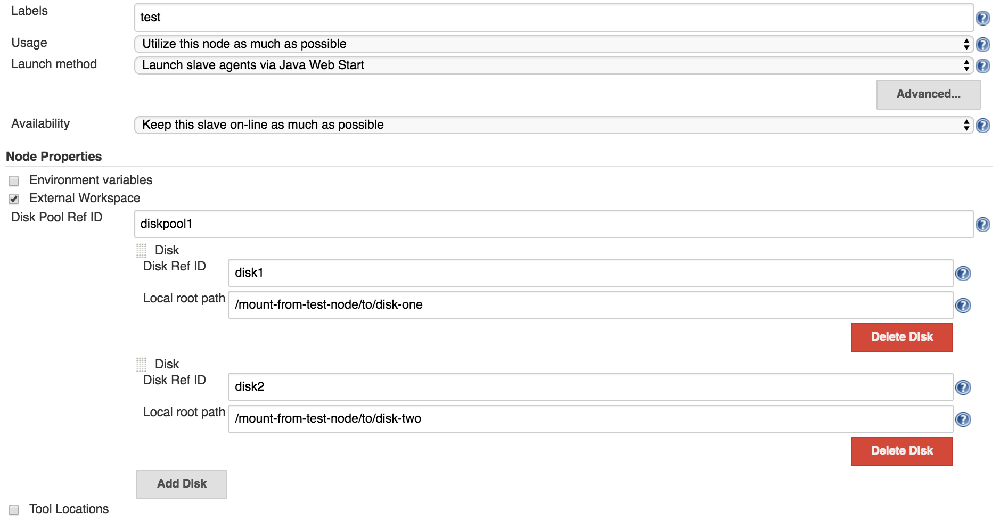
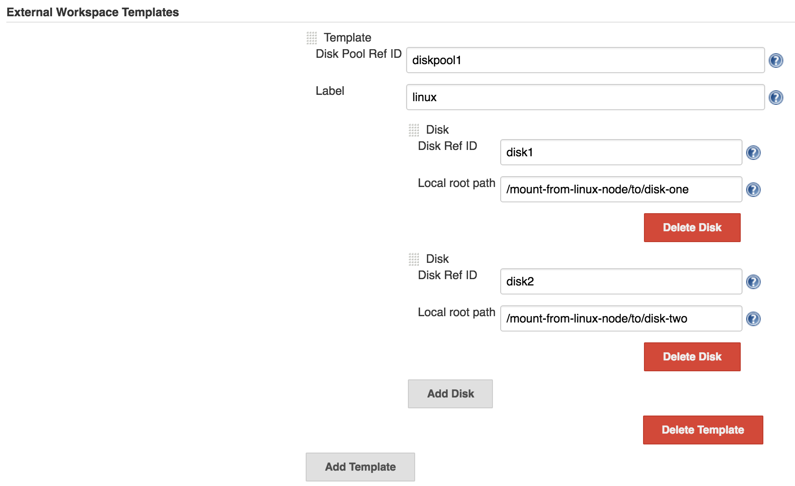

# Prerequisites
A set of prerequisites needs to be set to have this plugin usable.

 - One or more physical disks accessible from Jenkins Master, most commonly via mounting points.
The disks may also be shared directories via NFS or Samba.
 - The same disks must be accessible from Jenkins Nodes.

## External Workspace Definitions

In the Jenkins global configuration, we need to define a Disk Pool (or more) that will contain the physical disks.
An example of such config is shown in the following image:

## Node Properties

In each Node configuration, we have to define the mounting point from the current node to each disk.
Let's assume that we have two nodes, one labeled _linux_, and the other one labeled _test_.
A common node configuration is shown below:

___

## External Workspace Templates

There may be cases when you have more than one Node with the same label.
Instead of specifying the same External Workspace Node properties for multiple Nodes that share the same label,
you can make use of the _External Workspace Templates_ from the Jenkins global config.

Below is an example of such config.
All the Nodes that are labeled _linux_ will use the properties that are defined in this config.
When the `exws` step is called, it will firstly try to find a matching in the External Workspace Templates for a given disk.
If no entries are defined, it will fallback to External Workspace properties from the Node config.

